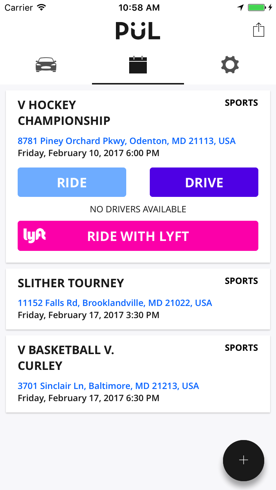
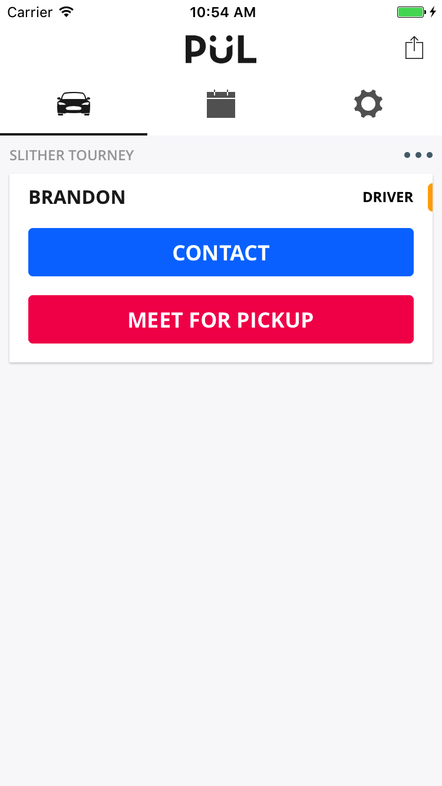
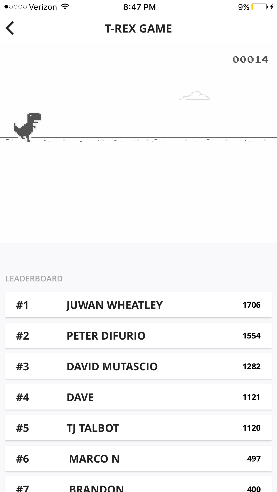

  

<h2 align="center" style="font-weight:600">
  PÜL
</h2>

  A carpooling app designed for students to help each other get more involved in their community.

---

<a href='https://play.google.com/store/apps/details?id=io.github.datwheat.pul&pcampaignid=MKT-Other-global-all-co-prtnr-py-PartBadge-Mar2515-1'>Google Play</a>

<a href='https://itunes.apple.com/us/app/p%C3%BCl-carpooling-for-students-by-students/id1196047562?ls=1&mt=8'>App Store</a>

## Screenshots

  
  
  
  

## Major technologies used

- Exponent
- React Native
- ex-navigation
- MobX
- Firebase
 

Check it out [here](https://exp.host/@pulapp/pul)! (although you most likely can't sign in unless you go to a supported school)
