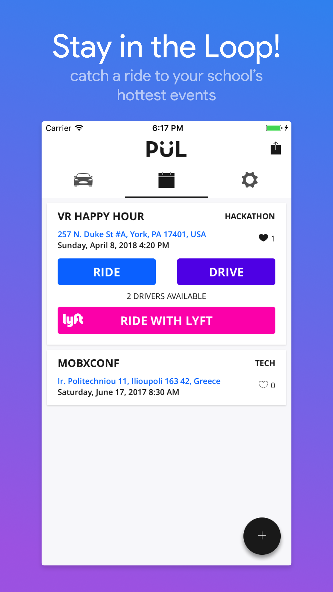
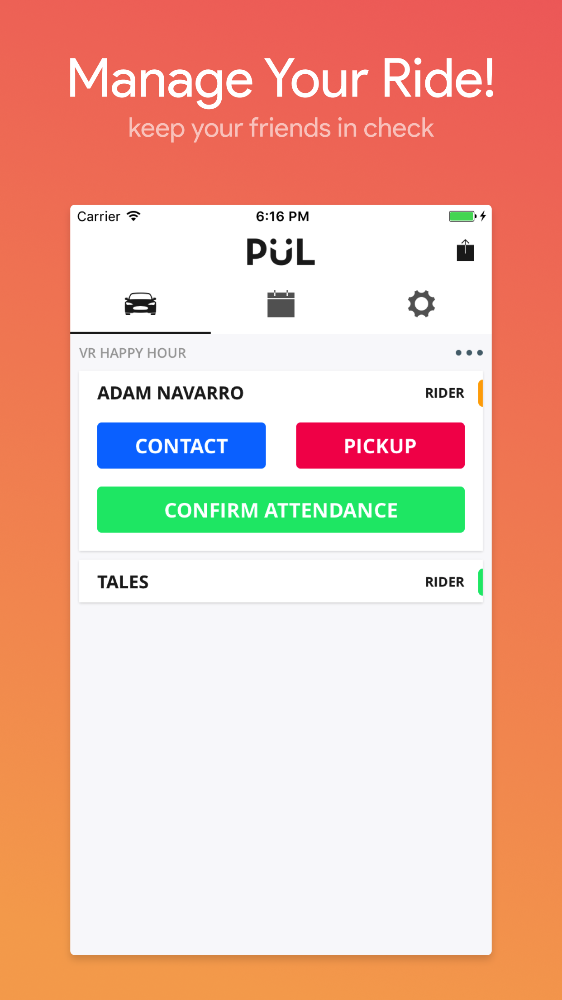
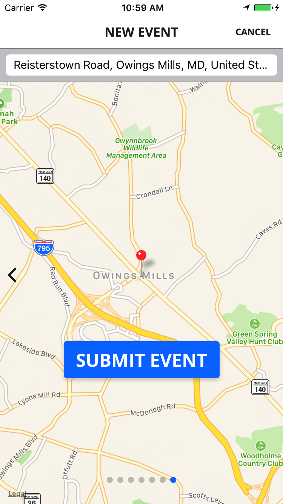
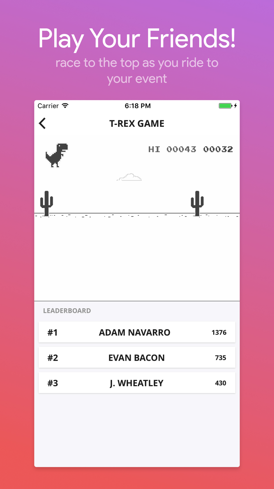

  

<h2 align="center" style="font-weight:600">
  PÜL
</h2>

  A carpooling app designed for students to help each other get more involved in their community.

---

[Get It on Expo!](https://expo.io/@pulapp/pul)

## Screenshots

  
  
  
  

## Major technologies used

- Expo
- React Native
- ex-navigation
- MobX
- Firebase
- Prettier
 
